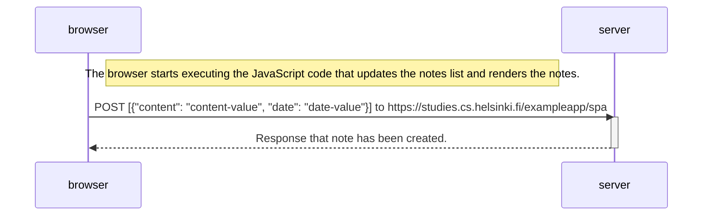

```mermaid
sequenceDiagram
participant browser
participant server

    Note right of browser: The browser starts executing the JavaScript code that updates the notes list and renders the notes.
    
    browser->>server: POST [{"content": "content-value", "date": "date-value"}] to https://studies.cs.helsinki.fi/exampleapp/spa
    activate server
    server-->>browser: Response that note has been created.
    deactivate server

```